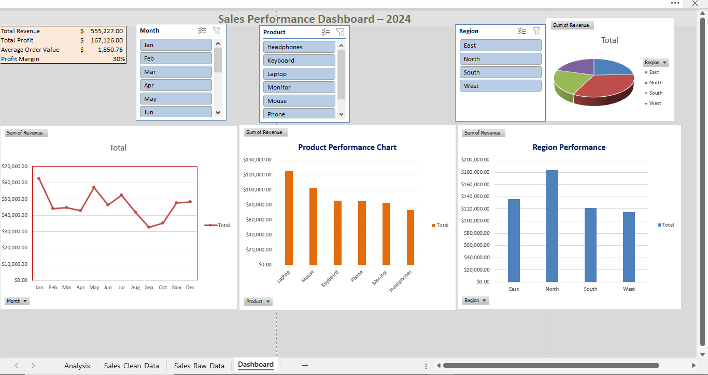

# Sales Performance Dashboard – 2024

## Project Objective
The goal of this project is to analyze sales data to understand overall business performance. 
The analysis focuses on identifying sales trends, top-performing products, high-revenue regions, and overall profitability.

## Dataset
The dataset contains 300 sales records with the following fields:

| Column Name     | Description                              |
|-----------------|------------------------------------------|
| Order Date      | Date when the sale was made              |
| Product         | Name of the product sold                 |
| Region          | Sales region                             |
| Salesperson     | Name of the salesperson                  |
| Revenue         | Total revenue from the sale              |
| Profit          | Profit earned from the sale              |
| Quantity Sold   | Number of units sold                     |

## Key Questions
- Which month recorded the highest sales?
- Which product generated the most profit?
- Which region contributed the highest revenue?
- How profitable are the overall sales?

## Key Performance Indicators (KPIs)
- Total Revenue – Shows the total sales generated during the year
- Total Profit – Indicates how much profit the business made
- Profit Margin – Measures profitability as a percentage of revenue
- Average Order Value – Shows the average value per customer order

## Insights
Sales show clear monthly trends, with certain months performing better than others.
A small number of products contribute a large portion of total revenue and profit.
One region consistently outperforms others in terms of sales contribution.
The profit margin indicates the overall efficiency of the business.

## Dashboard
An interactive Excel dashboard was created using pivot tables, charts, and slicers.
Users can filter data by region, product, and month to explore sales performance dynamically.

Dashboard Sneek Peek:

## Dashboard Interactivity Demo (Slicers)
The dashboard includes slicers that allow users to filter the data by region, product, and month. 
When a slicer is selected, all charts and KPIs update instantly, making it easier to explore 
sales performance and compare different segments.

[Watch dashboard interactivity video](slicer_and_changes.mp4)

